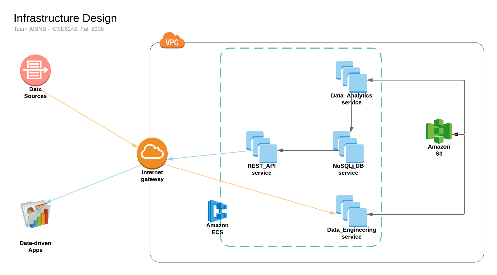

# AIBNB

## Abstract

Airbnb is an online platform that enablespeople to lease or rent properties for shor-term stays. Our goal in this project was to make use of historical Airbnb listings data, as well as user review sentiment data, to provide point-in-time rental price predictions for large metropolitan areas and major cities. We aim to use sentiment analysis and gradient boosted regression trees with the XGBoost algorithm to generate these predictions and share them with users via a web-based visualization tool.

## Description

The AIBNB application is composed of four different components - data engineering, REST API, analytics and frontend.

See below for a description of each component:

1. The data engineering component contains modules, functions and scripts to scrape reviews, calendar, and listings datasets from the www.insideairbnb.com website. It downloads, cleans, formats, and writes the data to an AWS-hosted MySQL database, where the records are served via a REST API.

2. The REST API component contains modules and functions to enable interaction between the database tables and the frontend. It was built using Flask and needs to run as a separate service in order for the frontend to retrieve data from the MySQL database.

3. The analytics component contains libraries and modules that perform sentiment analysis on review data and run the modelling experiments used for the final report. It also contains the code that generates the final predicted prices table that is displayed on the front-end. The code in this module performs the following steps:
   * Generate sentiment scores for each listing in the __aibnb.listings__ table that has a corresponding set of reviews in the __aibnb.reviews__ table, and write the outputs to the __aibnb.listings_sentiment__ table in the DB
   * Train an XGBoost regression model to predict the price of a listing on a given date
   * Run experiments and produce graphs to compare the peformance of the XGboost model using the sentiment scores as additional features vs not using the sentiment scores
   * Use the XGBoost pricing model to predict rental prices for a set of listing IDs across various calendar dates

4. The frontend component is a data-driven application and map-based UI used to allow users to interact with the results of our model's predicted prices. It was built using React and interacts with the MapBox API to display listing data for all locations available in our datasets.

## Installation

We used Docker to run the data engineering and analytics modules in order to simplify package and dependency management. In order to install the application locally, ensure your working directory is set to the "CODE" directory and follow the steps below:

1. Create an AWS account, if you do not already have an existing account.

2. Install the following software packages
   * Docker Community Edition 18.06.1 or higher
   * node.js 10.13.0 LTS

3. You will need to set up a MySQL database server instance on AWS and save the host details (e.g. URL, username, password). Please follow the tutorial [here](https://aws.amazon.com/getting-started/tutorials/create-mysql-db/) to create a MySQL DB instance on AWS.

4. Once you have created your database server, you will need to create a database named __aibnb__ and ensure that your DB user has full privileges (CREATE/MODIFY/DELETE) on this database.

5. Build the data engineering module Docker image using the following steps:
   * Update the MySQL database details in "integrate.sh" Shell scripts in the __backend/data_eng/calendar__ and __backend/data_eng/reviews__ directories to use your own DB details
   * Update the MySQL database details in the __backend/data_eng/listings/2mysql.py__ Python file to use your own DB details
   * Run `cd backend/data_eng`
   * Run `docker build . -t data_eng`

6. Build the REST API module Docker image using the following steps:
   * Update the MySQL database details in the __backend/rest_api/rest/connect_db.py__ Python file with your own DB details
   * Run `cd backend/rest_api`
   * Run `docker build . -t rest_api`

7. Build the analytics module Docker image using the following steps:
   * Update the MySQL database details in the __backend/analytics/.env__ environment file with your own DB details
   * Run `cd backend/analytics`
   * Run `docker build . -t analytics`

8. Install the frontend application component using the following steps:
   * Run `cd frontend/aibnb`
   * Run `yarn install`

## Execution and Deployment

To run the application locally, you will need to ensure that your AWS MySQL database is running and has sufficient CPU, RAM and disk space to handle the creation of all the database tables and returning query results to the frontend. Furthermore, your local client should have sufficient RAM and disk space (at least 16 GB RAM, 40 GB disk space) to train the machine learning models and run all the modelling experiments. Please follow the steps below to run the application locally.

WARNING: Running the application E2E will take many hours (at least 12 to 24 hours) because of the large amount of data that needs to be downloaded, processed and uploaded, as well as the training and scoring of the machine learning models.

1. Change your working directory to the __CODE/backend__ directory.

2. Run the data engineering module and generate all the database tables by following the steps below:
   * Run `mkdir /data`
   * Run `docker run -it --rm -v /data:/data data_eng` to start an interactive Shell session in the data engineering Docker container
   * In the container's Shell session, run `./data_eng_pipeline.sh`

3. Run the analytics module to train all the models, generate all experiment outputs (graphs, tables, etc.) and create the final __calendar_predicted__ table which contains the predicted prices for all of the records in the "calendar" table - follow the steps below:
   * Run `docker run -it analytics` to start an interactive Shell session inside the analytics Docker container
   * Once inside the container's Shell session, change your working directory to the __sentiment__ directory and run `./run_sa.sh` to generate sentiment scores and write them to the MySQL DB
   * Change your working directory to the __pricing__ folder and run `./run_pricing_train` to train the ML models and generate experiment outputs
   * Run `./run_pricing_score.sh` to load the best model and score the records in the __aibnb.calendar__ table, and write the outputs to the __aibnb.calendar_predicted__ table

4. Start the REST API by changing your working directory to the __CODE/backend/rest_api__ directory and running `docker run -d rest_api`. This will run the REST API container in detached mode until you force stop the container.

5. Change your working directory to the __CODE/frontend/aibnb__ directory and run `npm run start` to start the frontend UI. The application will now be accessible at [http://localhost:3000](http://localhost:3000).
